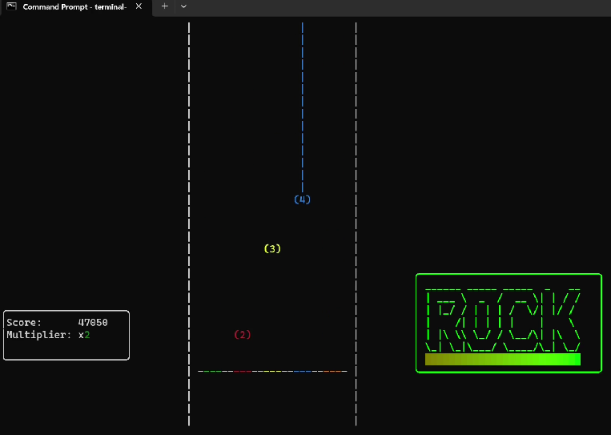

# Terminal Hero

Similar to Guitar Hero and Rock Band but runs in a terminal. Supports standard .chart and .mid files to allow easy importing of songs from other games including Guitar Hero and Rock Band.

## Demo

https://www.youtube.com/watch?v=A1YAOn0saYY



## Download and install from source

Requires `go` command line tools to compile and install the Go code.

```bash
git clone https://github.com/omccully/terminal-hero.git
cd terminal-hero/terminal-hero
go install .
```

Then make sure the `%GOPATH%/bin` path is part of your PATH environmental variable to be able to play the snake game from any working directory.

## Game data folders

Place song folders in the `Terminal Hero/Songs` folder in your user profile folder (`%USERPROFILE%/Terminal Hero/Songs` on Windows or `~/Terminal Hero/Songs` on Mac and Linux).

Each song should be in a separate folder and should contain:

- either a notes.mid file or a notes.chart file. notes.mid files will be automatically converted to notes.chart.
- guitar.ogg file
- song.ogg file
- rhythm.ogg file (optional)

You can organize and group the songs into various folders as desired.

The `Terminal Hero/.db` folder contains the SQLite database file that contains high scores.

## Downloading and importing songs

Because Terminal Hero supports the standard midi and chart file formats, you can download songs to play from this spreadsheet:

https://docs.google.com/spreadsheets/u/0/d/13B823ukxdVMocowo1s5XnT3tzciOfruhUVePENKc01o/htmlview#gid=0

## Usage

Start the game by typing `terminal-hero` in your terminal

## Playing

You can play with the number keys 1 through 5. When a note crosses the strum line, you must tap that key on the keyboard. Hitting the note increases your score, and missing notes could cause you to fail the song. The scoring is similar to Guitar Hero. Your scores are saved when you set a new high score on a song.

You may play with your keyboard in your hand to mimic holding a guitar. A mechanical keyboard is preferrable, since most standard keyboards don't allow you to press certain buttons at the same time, so you may have problems hitting certain chords. 

You can also use the keys above the space bar (vbnm,./) to repeat the last successfully-played note. This allows you to hit fast repeated notes, especially fast repeated chords. 

Held notes are displayed, but they do not affect your score. You should not hold down any keys because that will end up repeating key event and you'll fail the song due to playing the same note too many times. This is a limitation of terminals. To help with this, you can disable key repeating or change the repeat timing in most operating systems and terminals.
